# Better Comments
**Better Comments** is a Visual Studio extension that gives you the ability to customize the font and opacity of your comments independently of the editor's font settings. 
It also adds four additional comment classifications, each classification with its own customizable foreground. 

<!-- Replace this badge with your own-->

<!-- Update the VS Gallery link after you upload the VSIX-->
Download this extension from the [VS Gallery](https://visualstudiogallery.msdn.microsoft.com/[GuidFromGallery]).

See the [changelog](CHANGELOG.md) for changes and roadmap.

---------------------------------------

## Features

- Additional comment classifications. Important, Question, Task, and Crossed. 
- Customizable foreground for each comment classification.
- Customize the font settings and opacity of your comments.
- Works with C#, F#, VB.NET, C/C++, JavaScript, Python, HTML, and XAML.

#### Comment Classifications

- Use '!' for Important.
- Use '?' for Question.
- Use "Todo" (Case ignored) for Task.
- Use 'x', 'X', or double comment for strikethrough (Crossed).

C#, F#, C/C++, and JavaScript 

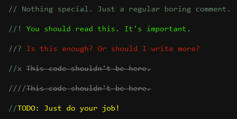

VB.NET 

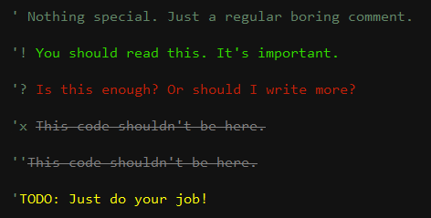

Python 

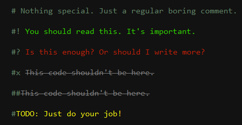

HTML/XAML (**Works only with single-line comments**) 

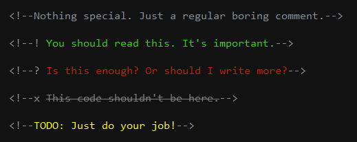

Multiline delimited comments (**Works only in C#**).

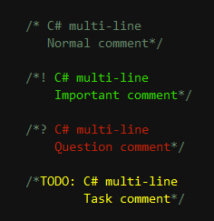

Single-line delimited comments (**Works in C#, F#, C/C++, and JavaScript**)

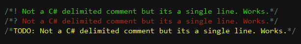

#### Custom Foreground Color for each Classification 

- You can set each comment classification foreground color to whatever you like.

- You can also set a particular comment classification font weight to bold.

   Go to Tools => Options => Fonts and Colors

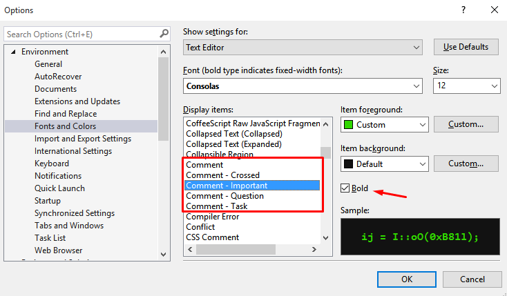

#### Independent Font Settings

- You can change the comments font settings without affecting the editor's font settings.

   Go to Tools => Options => Better Comments => Font Options

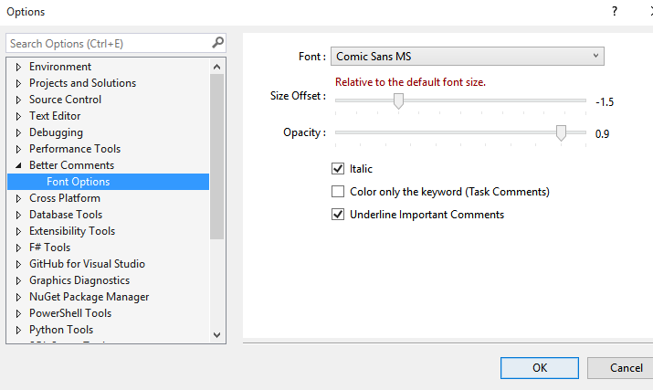

- You can use whatever font you like.

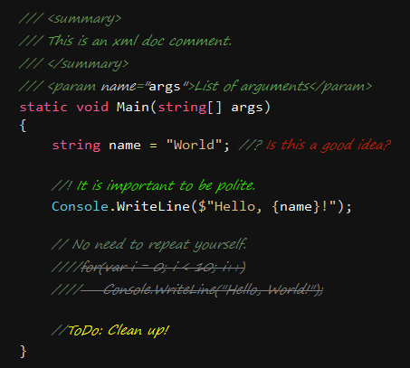

- You can offset the comment font size relative to the font size of the editor. Make it larger or smaller.

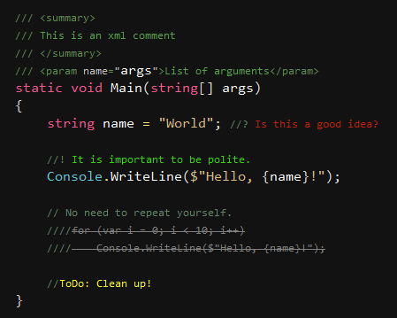

- You can italicize comments.

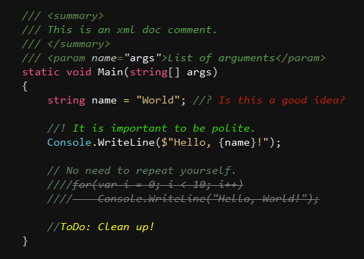

- You can control the comments opacity.

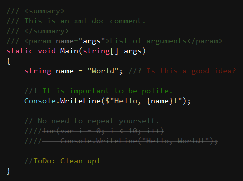

## Contribute
Check out the [contribution guidelines](CONTRIBUTING.md)
if you want to contribute to this project.

## License
[Apache 2.0](LICENSE)